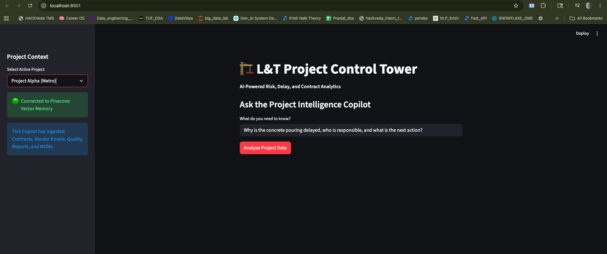
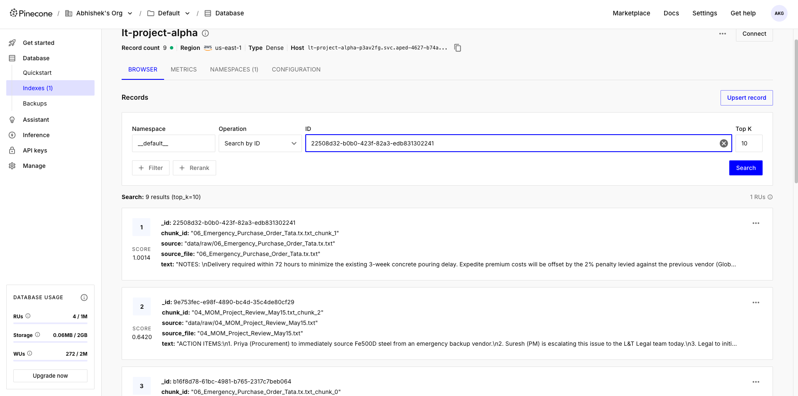
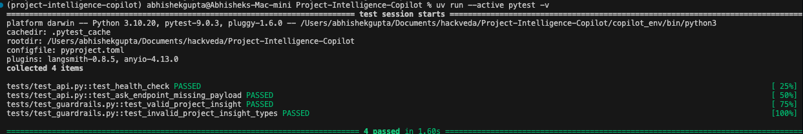

# 🏗️ L&T Project Intelligence Copilot

[](https://www.python.org/)
[](https://fastapi.tiangolo.com/)
[](https://streamlit.io/)
[](https://python.langchain.com/)
[](https://www.pinecone.io/)

**Project Intelligence Copilot** is an enterprise-grade Generative AI application designed to act as a proactive control tower for heavy infrastructure projects. By ingesting unstructured project data (Contracts, BOQs, Meeting Minutes, and Vendor Emails) into a vector database, it utilizes a hallucination-resistant Retrieval-Augmented Generation (RAG) pipeline to instantly identify project delays, calculate risk scores, and recommend mitigation actions based on exact contract clauses.

---

## 📸 System Showcase


https://github.com/user-attachments/assets/623d1ff1-ce36-4444-b2a3-b9d31711ad63


### 1. The Control Tower (Streamlit Frontend)
> Displays multi-hop reasoning, calculated risk scores, and explicit evidence citations.


### 2. Vector Memory (Pinecone Serverless)
> 1536-dimensional semantic chunks successfully embedded and indexed.


### 3. CI/CD & Guardrails (Pytest Integration)
> Pydantic schema validation ensuring strict JSON outputs and zero LLM hallucinations.


---

## 🧠 System Architecture

The architecture relies on a strict separation of concerns, decoupling the frontend UI from the AI reasoning engine and the vector data pipeline.

```text
=======================================================================================
                   L&T PROJECT INTELLIGENCE COPILOT - ARCHITECTURE
=======================================================================================

[ 1. CLIENT & API LAYER ]
      +------------------------+
      |  Customer Dashboard /  |  <-- (Streamlit UI)
      |  Project Control Tower |
      +-----------+------------+
                  |  JSON POST /ask
                  v
      +------------------------+
      |    FastAPI Backend     |  <-- (Entry point, Auth, Rate Limiting)
      |    (uvicorn server)    |
      +-----------+------------+
                  |
==================|====================================================================
                  v
[ 2. ORCHESTRATION & REASONING LAYER (LangChain LCEL) ]

      +------------------------+       +------------------------------------+
      |  Query Understanding   | ----> |  Pydantic Guardrails (Validation)  |
      +-----------+------------+       +------------------------------------+
                  |                                     ^
                  v                                     | (Enforces JSON Schema)
      +------------------------+       +----------------+-------------------+
      |   Vector Retriever     |       |       LLM Reasoning Engine         |
      |   (Similarity Search)  | ====> |     (OpenAI gpt-3.5-turbo)         |
      +-----------+------------+       +------------------------------------+
                  | Fetch Top K chunks                  ^
==================|=====================================|==============================
                  v                                     |
[ 3. DATA & MEMORY LAYER (Ingestion Pipeline) ]         |
                                                        |
      +------------------------+                        |
      |   Vector Database      | -----------------------+ (Provides Context & Metadata)
      |  (Pinecone Serverless) |
      +-----------+------------+
                  ^
                  | (Upserts embedded chunks)
      +------------------------+
      |    Embedding Model     |  <-- (OpenAI text-embedding-3-small)
      +-----------+------------+
                  ^
                  | (Passes semantic chunks)
      +------------------------+
      | Data Engineering Pipeline| <-- (PyPDFLoader, TextSplitter)
      |  (Extraction & Chunking) |
      +-----------+------------+
                  ^
                  |
      [ Raw L&T Project Documents (Contracts, BOQs, MOMs, Safety Reports) ]
